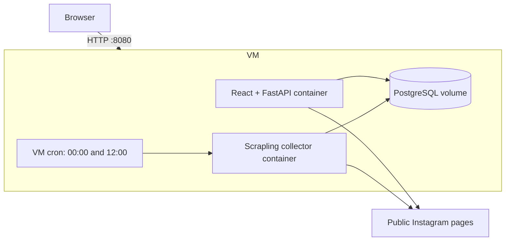

# InstaTrack CRM

InstaTrack is a shared Instagram analytics workspace for Dachi, Lui, and Saba. One team password opens a Netflix-style profile chooser; the selected name is recorded when a tracking profile is added. The dashboard is empty in production and fills from twice-daily observations.

## What is included

- Dashboard, tracked profiles, reels, profile/reel details, collection health, search, sorting, and CSV export.
- Public-profile link validation, duplicate prevention, a 100-profile cap, archival without deleting history, and initial collection requests.
- Nullable metric storage with explicit available, unavailable, stale, and failed states.
- Anonymous Scrapling browser collection of follower counts and the newest 30 reels, including views, likes, comments, captions, hashtags, creator details, and publication dates when Instagram exposes them. Instaloader remains available as an explicit fallback adapter.
- PostgreSQL history, signed secure sessions, Argon2 password verification, persistent login throttling, and persona attribution.
- GCP Compute Engine VM hosting with Docker Compose, PostgreSQL on a persistent Docker volume, and Scrapling collection scheduled by VM cron at `00:00` and `12:00` in `Asia/Tbilisi`.

Anonymous Instagram collection is intentionally best effort. It stops on login challenges or throttling and keeps the last successful values as stale. It does not bypass Instagram access controls.

## Production architecture

The active production target is one Ubuntu Compute Engine VM. The API container serves both FastAPI and the built React application on port `8080`. PostgreSQL runs in a private container and exposes its host port only on `127.0.0.1`. A separate collector container runs from VM cron twice per day; adding a profile can also trigger the Scrapling collector inside the API container for the initial fetch.



Docker restarts the API and database automatically after a VM reboot. Team-password verification material and the session secret live in the VM's permission-restricted `.env` file. HTTPS can be added in front of port `8080` with Caddy, Nginx, or a Google Cloud load balancer.

## Start locally with one click

On macOS, double-click `start.command`. The first launch installs the required packages and Scrapling browser, builds the interface, starts the frontend and backend together, and opens `http://127.0.0.1:8080`.

The default local team password is `instatrack`. Team passwords must contain at least 8 characters. To choose another password, launch from Terminal:

```bash
TEAM_PASSWORD='your-password' ./start.sh
```

Adding a profile while using this launcher queues an immediate local Scrapling collection. Press Control-C in the launcher window to stop the application. Later launches reuse installed packages and the local SQLite data in `.local/`.

## Preview only

The frontend has a deliberate demo mode for visual review. Demo data is enabled only by a URL flag and is never used by the production API.

```bash
cd frontend
npm install
npm run dev
```

Open `http://127.0.0.1:4173/?demo=1`.

## Run locally with Docker

For the Docker workflow, install the backend dependencies, generate an Argon2 hash, then set the two local secrets:

```bash
cd backend
python3 -m venv .venv
.venv/bin/pip install -r requirements-dev.txt
.venv/bin/python ../scripts/hash_password.py
```

Copy the printed hash into `TEAM_PASSWORD_HASH`, generate a long random `SESSION_SECRET`, and start the stack:

```bash
TEAM_PASSWORD_HASH='the-printed-hash' SESSION_SECRET='at-least-32-random-characters' docker compose up --build
```

The application is then available at `http://localhost:8080`. Run a manual collector pass with:

```bash
docker compose --profile manual run --rm collector --trigger manual
```

## Deploy on GCP Compute Engine

Create an Ubuntu VM with at least 2 vCPUs and 4 GB RAM, attach a static external IP, and allow inbound TCP `8080` while testing. Clone the repository on the VM, then run:

```bash
chmod +x scripts/update_vm.sh
./scripts/update_vm.sh
```

The first run installs Docker and cron, asks for the shared password, creates `.env`, builds the application image, starts the stack, and installs the midnight/noon `Asia/Tbilisi` schedule. The API and scheduled collector share that image, so Scrapling and its browser are built only once. Later runs skip Ubuntu package installation, pull the selected Git branch (default `main`), reuse Docker's dependency layers, rebuild changed application files, restart the services, and preserve PostgreSQL data and existing secrets. Set `VM_BRANCH` before running if the VM should follow another branch.

Open `http://VM_EXTERNAL_IP:8080`. For future GitHub updates, run the same command again. Check the running services and collector log with:

```bash
sudo docker compose ps
sudo docker compose logs -f api
sudo tail -f /var/log/instatrack-collector.log
```

## Validate anonymous collection

The gate can be run without writing to the database. Scrapling is the default adapter:

```bash
cd backend
.venv/bin/python -m app.probe instagram creators --adapter scrapling
```

To compare the previous collector, pass `--adapter instaloader`. Scrapling uses a rendered anonymous browser session and captures public Instagram page/API responses. It stops and reports an unavailable or throttled state when Instagram presents a login wall, challenge, or rate limit; it does not solve or bypass those controls.

Run the collector from the deployed VM before relying on the metrics. Confirm `followers_available`, reel discovery, and `views_available` against the public Instagram pages. If follower counts or reel views are blocked from the VM's GCP IP, the stated no-login requirement conflicts with dependable collection and those values will remain unavailable.

```bash
sudo docker compose --profile manual run --rm collector --trigger manual
```

## Optional legacy managed GCP deployment

The repository still contains the earlier Cloud Run, Cloud SQL, Cloud Scheduler, and Terraform deployment path. It is retained for a future migration but is not the active VM architecture.

### Easiest first deployment

Push this folder to GitHub, open [Google Cloud Shell](https://shell.cloud.google.com/), clone the repository, and run:

```bash
./scripts/deploy_gcp.sh YOUR_GCP_PROJECT_ID
```

The script asks for the shared CRM password, enables the required APIs, creates the Artifact Registry repository and a versioned Terraform state bucket, builds both containers in Cloud Build, and applies Terraform. Terraform creates Cloud SQL, Secret Manager secrets, the web service, the private Scrapling job, and the midnight/noon Tbilisi schedule. The command prints the live application URL when it finishes. Billing must already be enabled on the project, and the signed-in account needs permission to create these resources.

To deploy to a different region, add it as the second argument:

```bash
./scripts/deploy_gcp.sh YOUR_GCP_PROJECT_ID europe-west4
```

### Deploy every GitHub push

After the first deployment, connect the GitHub repository in **Google Cloud → Cloud Build → Triggers**, create a push trigger for the `main` branch, and select `cloudbuild.deploy.yaml` as the configuration file. Every later push then rebuilds and updates the web service and Scrapling job. The bootstrap script already grants the Cloud Build service account the required deployment roles.

The GitHub connection requires one interactive authorization because Google installs its GitHub App for the selected repository. Google documents the flow in [Connect to a GitHub repository](https://docs.cloud.google.com/build/docs/automating-builds/github/connect-repo-github) and [Continuous deployment from Git](https://docs.cloud.google.com/run/docs/continuous-deployment).

### Manual deployment steps

1. Create an Artifact Registry Docker repository and configure Docker authentication for it.
2. Build and push both images from the repository root:

   ```bash
   gcloud builds submit --tag europe-west1-docker.pkg.dev/PROJECT/instatrack/api:latest .
   gcloud builds submit --config cloudbuild.collector.yaml --substitutions=_IMAGE=europe-west1-docker.pkg.dev/PROJECT/instatrack/collector:latest .
   ```

3. Generate the team password hash with `scripts/hash_password.py`.
4. Copy `infra/terraform/terraform.tfvars.example` to `terraform.tfvars`, fill in the project and image values, then apply:

   ```bash
   gcloud storage buckets create gs://PROJECT-instatrack-tfstate --location=europe-west1 --uniform-bucket-level-access
   gcloud storage buckets update gs://PROJECT-instatrack-tfstate --versioning
   cd infra/terraform
   terraform init -backend-config="bucket=PROJECT-instatrack-tfstate"
   terraform plan
   terraform apply
   ```

Terraform creates the database with backups and point-in-time recovery, stores application secrets in Secret Manager, grants narrowly scoped service identities, deploys the two Cloud Run workloads, and configures the Tbilisi schedule. Its output contains the application URL.

## API surface

Authenticated endpoints cover session/persona selection, profile creation/listing/archive/history, reel listing/details/history, dashboard summaries, collection-run health, and CSV exports. API documentation is served at `/api/docs` after deployment.

History views accept `from=YYYY-MM-DD` and `to=YYYY-MM-DD` query parameters. Date boundaries use `Asia/Tbilisi`; when omitted, the existing `days` presets are used. Profile and reel listings also accept scrape-date filters (`last_scraped_after`, `last_scraped_before`, `observed_after`, and `observed_before`).

## Tests

```bash
cd frontend && npm run build
cd ../backend && .venv/bin/pytest
terraform -chdir=infra/terraform fmt -check
terraform -chdir=infra/terraform validate
```
